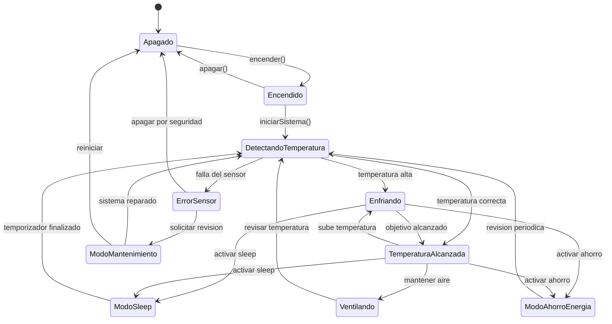

# Aire Acondicionado Inteligente con Patron State

## Descripcion

Proyecto completo de simulacion de un aire acondicionado inteligente. El backend expone una API en NestJS y el frontend muestra una interfaz en React con Vite para observar visualmente los cambios de estado del sistema.

## Objetivo

Demostrar como un objeto puede cambiar su comportamiento dependiendo de su estado interno sin concentrar toda la logica en condicionales `if` o `switch`. El sistema modela un A/C que pasa por estados como apagado, encendido, deteccion de temperatura, enfriamiento, ventilacion, sleep, ahorro de energia, error de sensor y mantenimiento. El usuario controla encender y apagar; los demas estados avanzan automaticamente mediante un temporizador de simulacion en el backend.

## Patron State

El patron State permite que un objeto contexto delegue sus acciones a un objeto estado. En este proyecto, `AireAcondicionado` es el contexto y `EstadoAC` define el contrato comun. Cada clase concreta, como `EstadoApagado` o `EstadoEnfriando`, decide que ocurre cuando se llama a `encender`, `apagar`, `detectarTemperatura` u otra accion.

Esto evita que `AireAcondicionado` tenga una gran cadena de condiciones para saber que debe hacer en cada situacion.

## Diagrama Mermaid



## Tecnologias

- Backend: NestJS con TypeScript
- Frontend: React con Vite y TypeScript
- Estilos: Tailwind CSS
- Arquitectura orientada a objetos
- Patron de diseno: State

## Estructura

```text
backend/
  src/ac/ac.controller.ts
  src/ac/ac.service.ts
  src/ac/aire-acondicionado.ts
  src/ac/states/
frontend/
  src/components/ACPanel.tsx
  src/components/EstadoCard.tsx
  src/components/ControlButtons.tsx
  src/components/HistorialEstados.tsx
  src/services/acService.ts
```

## Ejecutar Backend

```bash
cd backend
npm install
npm run start:dev
```

El backend queda disponible en:

```text
http://localhost:3000
```

Endpoint principal:

```text
GET http://localhost:3000/ac/estado
```

## Ejecutar Frontend

En otra terminal:

```bash
cd frontend
npm install
npm run dev
```

El frontend queda disponible en:

```text
http://localhost:5173
```

## Endpoints

- `GET /ac/estado`
- `POST /ac/encender`
- `POST /ac/apagar`
- `POST /ac/detectar-temperatura`
- `POST /ac/cambiar-temperatura`
- `POST /ac/cambiar-temperatura-objetivo`
- `POST /ac/activar-sleep`
- `POST /ac/activar-ahorro`
- `POST /ac/reportar-error`
- `POST /ac/mantenimiento`
- `POST /ac/reiniciar`

Cada endpoint devuelve estado actual, descripcion, temperatura actual, temperatura objetivo, mensaje e historial de cambios. El endpoint `GET /ac/estado` se puede consultar repetidamente para ver como avanza la simulacion.

## Ejemplo de Flujo

1. Consultar el estado inicial: `GET /ac/estado`.
2. Encender el sistema: `POST /ac/encender`.
3. Esperar unos segundos o mirar el frontend.
4. El backend avanza solo por `DetectandoTemperatura`, `Enfriando`, `TemperaturaAlcanzada`, `Ventilando`, `ModoAhorroEnergia` y `ModoSleep`.
5. En ciclos posteriores puede aparecer `ErrorSensor`; despues la simulacion pasa a `ModoMantenimiento` y vuelve a revisar temperatura.
6. Apagar el sistema cuando se desee: `POST /ac/apagar`.

## Conclusion

El patron State es adecuado porque el aire acondicionado tiene reglas diferentes segun su estado interno. Al separar cada comportamiento en una clase, el codigo queda mas claro, extensible y facil de mantener. Para agregar un nuevo modo no es necesario modificar una clase llena de condiciones; basta con crear otro estado que implemente `EstadoAC`.
